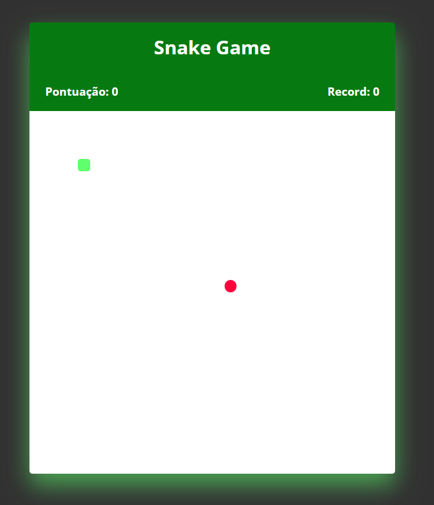

# Snake Game

Este é um jogo da cobrinha clássico criado usando HTML5, CSS3 e Javascript. Os jogadores podem controlar a cobra usando as setas do teclado para pegar comida e aumentar seu tamanho enquanto evitam colidir com as paredes ou com o próprio corpo da cobra.

## Como Jogar

1. Clone ou faça o download do repositório em sua máquina local.
2. Abra o arquivo `index.html` em seu navegador da web.
3. Use as teclas de seta (↑, ↓, ←, →) para controlar a direção da cobra.
4. Colete a comida (representada por um objeto) para aumentar o tamanho da cobra.
5. Evite colidir com as bordas do jogo ou com o próprio corpo da cobra.
6. O jogo termina quando a cobra colide com as bordas ou consigo mesma.
7. Você pode reiniciar o jogo clicando no botão "Reiniciar" na tela de fim de jogo.

## Recursos

- O jogo é criado usando HTML5, CSS3 e Javascript puro, não sendo necessário nenhuma biblioteca externa.
- A interface do jogo é simples e intuitiva para uma experiência de jogo fácil.

## Videoaula

Este projeto foi baseado na videoaula do YouTube "[CodingNepal] - [Create A Snake Game in HTML CSS & JavaScript]" disponível em [https://www.youtube.com/watch?v=K8Rh5x3c9Pw](https://www.youtube.com/watch?v=K8Rh5x3c9Pw).

## Contribuições

Contribuições são bem-vindas! Sinta-se à vontade para abrir problemas (issues) ou enviar solicitações de pull (pull requests) para melhorar este projeto.

## Have Fun

Divirta-se jogando o Snake Game! 🐍
